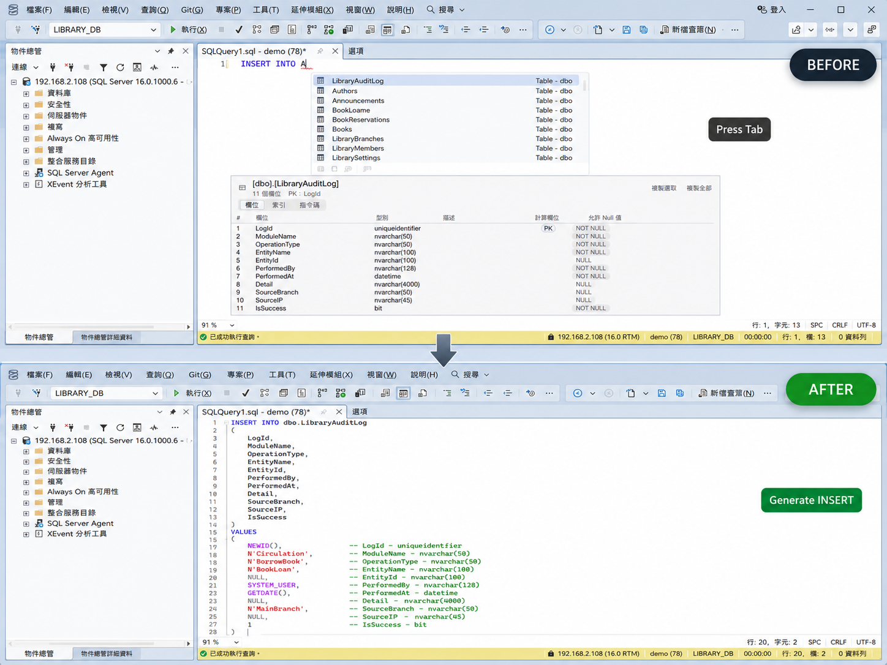
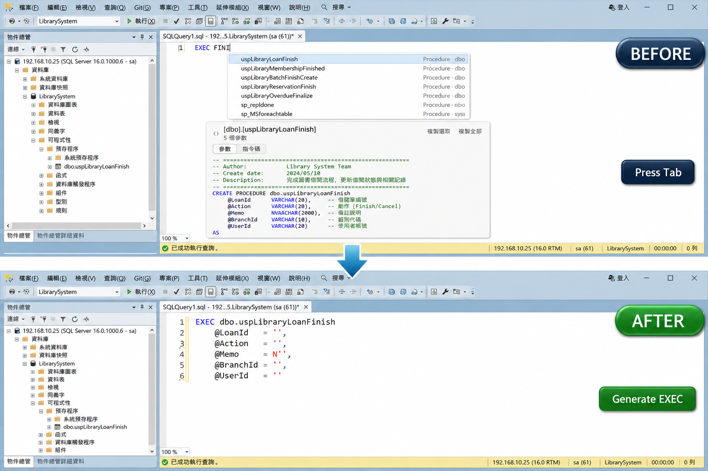
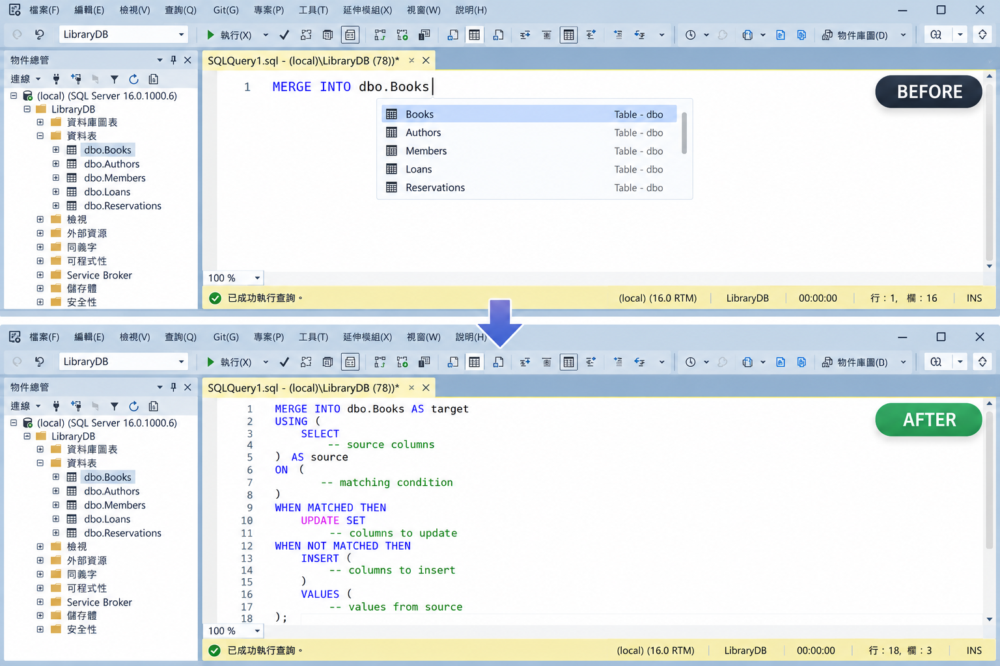
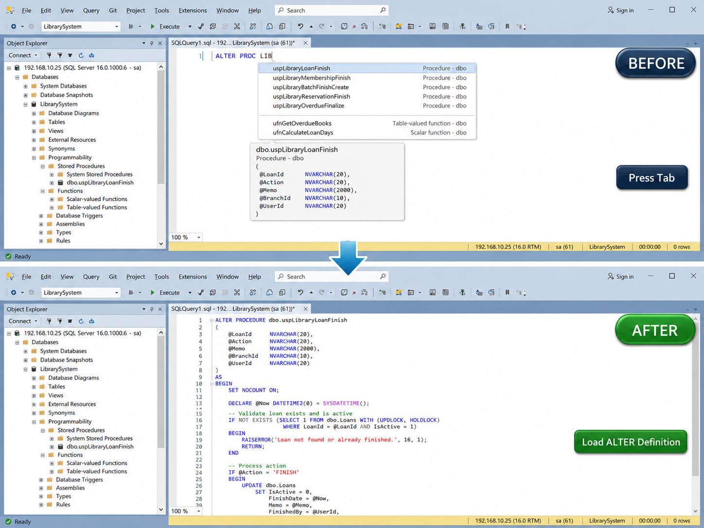
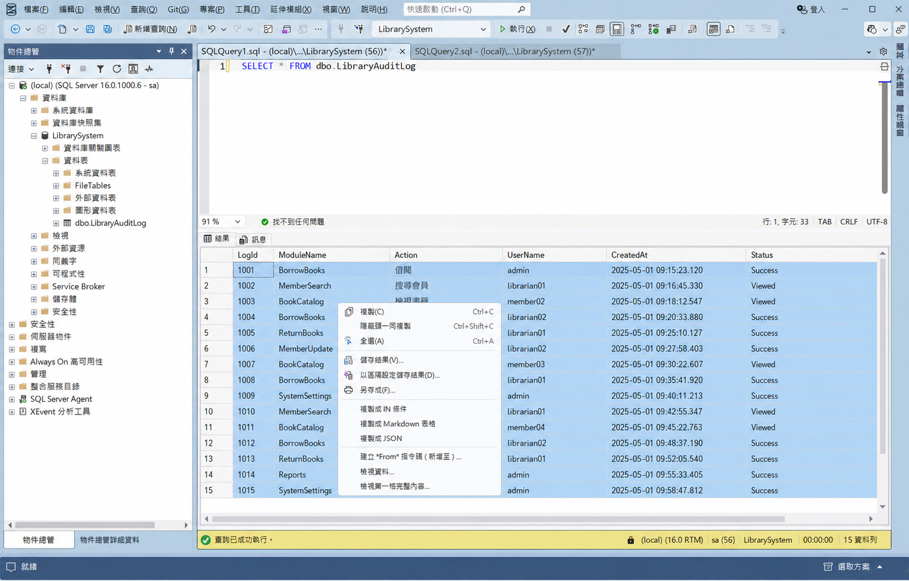

# SqlAssist for SSMS 22

**Database-aware completion, SQL expansion, and previews inside the SSMS 22 T-SQL editor.**

[English](README.md) · [繁體中文](README.zh-TW.md)

SqlAssist is an **SSMS 22** VSIX, not a separate editor. Suggestions run locally; metadata comes only
from your connected SQL Server, with no cloud service or AI model involved.

[Download](https://github.com/a73013110/SqlAssist.Ssms22/releases) ·
[Get started](docs/getting-started.md) · [Docs](docs/index.md) ·
[Report an Issue](https://github.com/a73013110/SqlAssist.Ssms22/issues)

## Feature tour

### Complete SQL with database context

Suggestions adapt to each SQL clause, with acronym/CamelHump matching, aliases, script variables,
temporary tables, live column details, and keyword casing.

### Expand boilerplate with Tab

Tab expands `*` into explicit columns. Committing an `INSERT`, `EXEC`, `MERGE`, or `ALTER` target
generates metadata-aware SQL ready to edit.

| `INSERT` | `EXEC` |
|:---:|:---:|
|  |  |
| **`MERGE`** | **`ALTER PROCEDURE / FUNCTION`** |
|  |  |

### Inspect objects without leaving the query

Preview columns, keys, indexes, parameters, and DDL in place. F12 opens the complete definition in a new
query window using the current connection.

### Turn result rows into useful output

Create a `#temp` script or `IN` list, copy Markdown or JSON, profile columns, and inspect cells truncated
by the SSMS grid.

Also included: T-SQL snippets with Tab Stops, automatic bracket/quote pairing, and feature toggles.

## Install

Requires **Windows x64** and **SSMS 22.9.x**.

1. Download `SqlAssist.Ssms22.vsix` from the latest [release](https://github.com/a73013110/SqlAssist.Ssms22/releases).
2. Close SSMS, run the VSIX installer, and restart SSMS.
3. **Tools → SqlAssist** confirms that it loaded.

> [!IMPORTANT]
> Keep SSMS T-SQL IntelliSense enabled; only its conflicting automatic list is suppressed.

> [!WARNING]
> [SSMS does not officially support third-party extensions](https://learn.microsoft.com/en-us/ssms/faq#are-extensions-supported-in-ssms).
> This project is validated on SSMS 22.9.x.

## Learn more

[Getting Started](docs/getting-started.md) covers setup and updates; [documentation](docs/index.md#主題)
covers features, settings, and development. Contributors begin with [CLAUDE.md](CLAUDE.md).
[MIT License](LICENSE).
