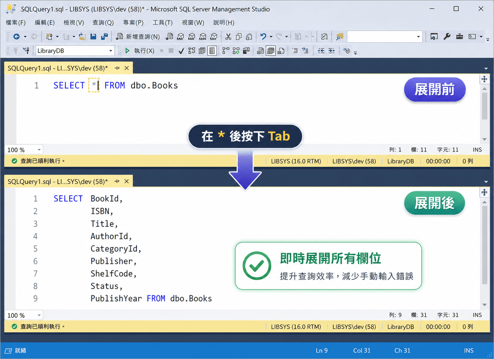
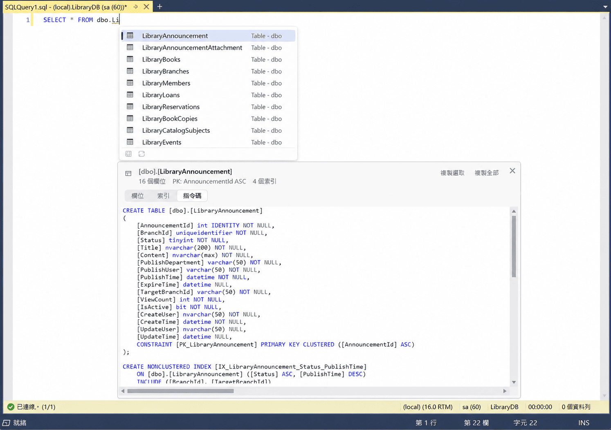

# SqlAssist for SSMS 22

**把 SSMS 22 的 T-SQL 編輯器補上「懂你目前這個資料庫」的即時建議、SQL 展開與物件預覽。**

[](https://github.com/a73013110/SqlAssist.Ssms22/releases)
[](LICENSE)


<p align="center">
  
</p>

SqlAssist 是安裝在 **SQL Server Management Studio 22** 裡的 VSIX 擴充套件，不是另一套
SQL 編輯器，也不是 SSMS 的修改版——你仍然在原本的查詢視窗裡工作。

建議完全在你的機器上算出來：需要的資料表、欄位與程序資訊，只向**你已經連上的那台
SQL Server** 查詢，不經過任何雲端服務，也沒有 AI 模型參與。

[安裝與開始使用](docs/getting-started.md) ·
[下載 VSIX](https://github.com/a73013110/SqlAssist.Ssms22/releases) ·
[回報問題](https://github.com/a73013110/SqlAssist.Ssms22/issues) ·
[開發者文件](docs/index.md)

## 三十秒看它做什麼

```sql
-- 1. 記得用途、記不得全名？打三個字母就找得到：libr → Tab
SELECT * FROM dbo.Lib_Reader

-- 2. 游標停在 * 後面按 Tab，換成明確欄位
SELECT
    Id,
    Name,
    BranchId
FROM dbo.Lib_Reader

-- 3. 打 ap → Tab 選一個預存程序，整份可執行的定義直接進編輯器，
--    游標停在名稱後面，可以立刻改、立刻執行
ALTER PROCEDURE dbo.usp_Loan_Renew
    @LoanId int,
    @Days   int = 7
AS
BEGIN
    ...
```

<p align="center">
  
</p>

<details>
<summary>再看兩張：建議清單與物件結構預覽</summary>

<br>

輸入 `Li` 就列出符合的資料表，選取的那一個在下方展開欄位、型別與 `PK`、`NOT NULL` 旗標：

<p align="center">
  
</p>

預覽的**指令碼**分頁給的是可以直接執行的完整定義，可以捲動、選取、複製：

<p align="center">
  
</p>

</details>

## 它能幫你做什麼？

| 寫 SQL 時遇到的事 | SqlAssist 的做法 |
|---|---|
| 記得用途，卻記不完整物件名稱 | 輸入 `libr`，用詞首感知的模糊比對找到 `Lib_Reader` |
| 不想離開編輯器查欄位 | 輸入 `lr.`，直接列出該來源的欄位、型別與主索引鍵 |
| 想把 `SELECT *` 改成明確欄位 | 游標停在 `*` 後按 Tab，展開成完整欄位清單 |
| 每次都要重打 `INSERT` 或 `EXEC` 骨架 | 選取物件後，自動補齊欄位、值或參數清單 |
| 想改一個預存程序，卻要先去物件總管找 | 打 `ap` 選它，完整的 `ALTER` 定義直接進編輯器 |
| 看到一個物件名稱，想知道它到底怎麼寫的 | 游標停在名稱上按 F12，另開查詢視窗顯示可執行的定義，沿用目前連線 |
| 想先確認資料表或預存程序的結構 | 滑鼠停留快速看摘要，或開啟可複製的完整結構預覽 |
| 常寫重複的 SQL 樣板 | 使用 45 筆內建片段，並以 Tab／Shift+Tab 在欄位間移動 |
| 括號與引號老是漏掉右邊那一個 | 打 `(`、`'` 就補上另一半；打結尾字元跳過、Backspace 一起收掉 |
| 想拿查詢結果的幾列去 debug | 在結果格線上選取後按右鍵，變成 `#temp` 指令碼或 `IN` 條件 |
| 一百多欄的結果不知道從哪看起 | 欄位剖析一次列出每一欄的 `NULL`、相異值數與範圍 |
| 一格塞了一大段 XML，格線上看不完 | 檢視完整內容，可以選、可以捲、可以複製 |

此外還包含依位置過濾的 T-SQL 關鍵字、內建函式與變數建議、輸入時自動大寫，以及
欄位／資料表／檢視等分類篩選。功能細節可從[使用與功能文件](#使用與功能文件)進入。

## 安裝

需要 **Windows x64** 與 **SSMS 22.9.x**。不必 clone 這個專案，也不必安裝 .NET SDK。

1. 到 [Releases](https://github.com/a73013110/SqlAssist.Ssms22/releases)，從最新版本的
   **Assets** 下載 `SqlAssist.Ssms22.vsix`。
2. 儲存查詢，關閉所有 SSMS 視窗。
3. 開啟 `.vsix`，確認安裝目標是 **SQL Server Management Studio 22**。
4. 重新啟動 SSMS。看到 **工具 → SqlAssist** 就代表裝好了。

裝不起來、想知道第一次該試什麼、或要解除安裝，看[安裝與開始使用](docs/getting-started.md)。

<details>
<summary>Releases 頁面顯示尚無任何版本？</summary>

代表目前還沒有公開、可直接安裝的 VSIX。GitHub 自動產生的 Source code 壓縮檔**不是**
安裝檔；想自行建置請看[開發文件](docs/development.md)。

</details>

> [!IMPORTANT]
> 請維持 SSMS 內建的 T-SQL IntelliSense 開啟。SqlAssist 預設只擋掉會互相干擾的
> 內建自動建議清單，紅色錯誤波浪線、大綱與參數提示仍由 SSMS 提供。

> [!WARNING]
> [SSMS 目前未正式支援第三方擴充套件](https://learn.microsoft.com/en-us/ssms/faq#are-extensions-supported-in-ssms)；
> 本專案以 SSMS 22.9.x 實機驗證，SSMS 更新後仍可能需要等待相容性確認。

## 使用與功能文件

| 我想知道…… | 文件 |
|---|---|
| 怎麼安裝、確認載入與開始使用 | [安裝與開始使用](docs/getting-started.md) |
| 建議清單、關鍵字大寫、欄位與整句展開 | [建議清單](docs/completion.md) |
| 內建／自訂片段與 Tab 欄位導航 | [程式碼片段](docs/snippets.md) |
| `SELECT *` 怎麼展開與排版 | [展開 SELECT *](docs/wildcard-expansion.md) |
| 括號與引號的自動配對 | [自動配對](docs/auto-pairing.md) |
| 滑鼠提示與完整物件結構預覽 | [物件結構預覽](docs/structure-preview.md) |
| F12 在新查詢視窗開啟物件定義 | [移至定義](docs/go-to-definition.md) |
| 把查詢結果變成 `#temp` 指令碼或 `IN` 條件 | [查詢結果格線](docs/result-grid.md) |
| 功能開關、顯示方式與診斷設定 | [設定](docs/settings.md) |

## 開發者入口

想閱讀原始碼、建置 VSIX 或參與開發，請從下列文件開始；README 只保留入口，不重複
專案內部細節。

- [文件索引](docs/index.md)：依「想改什麼」或檔案路徑找到對應文件與程式碼。
- [建置、測試、安裝與發布](docs/development.md)：開發環境與工具腳本。
- [架構](docs/architecture.md)：Core、Metadata 與 SSMS 接線層的分工。
- [專案開發規範](CLAUDE.md)：動手前必讀的限制與踩坑記錄。

本專案採用 [MIT License](LICENSE)。
