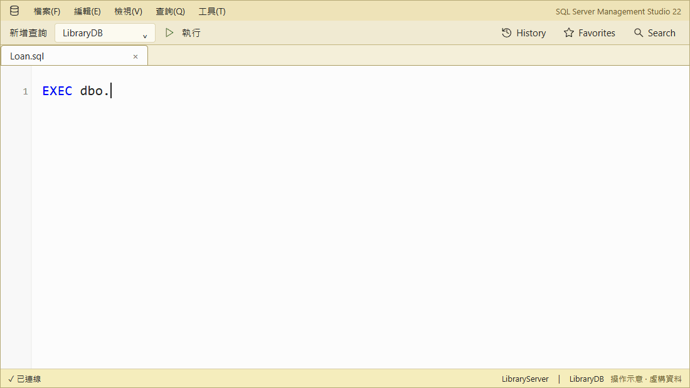
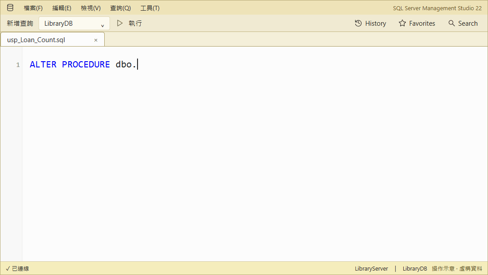

# SqlAssist for SSMS 22

**Complete SQL, inspect objects, and save queries in SSMS 22.**

[繁體中文](README.zh-TW.md)

An **SSMS 22** extension with local suggestions and metadata—no cloud or AI.

[Start](docs/getting-started.md) · [Docs](docs/index.md) ·
[Issues](https://github.com/a73013110/SqlAssist.Ssms22/issues)

## Feature tour

Demos use fictional data; they are illustrations, not recordings.
[Play, pause, and replay every demo](https://a73013110.github.io/SqlAssist.Ssms22/demos/feature-demos.html).

### Complete SQL and inspect objects

Type `libr` → **Right Arrow** previews columns → **Tab** inserts `Lib_Reader`. Suggestions understand
clauses, fuzzy matches, aliases, and temp tables.

[PNG](docs/images/completion-preview-demo.png)

From the same list, press **Right Arrow** and open **Script** to see the object's columns and DDL.

[PNG](docs/images/structure-preview-demo.png)

On `Loan`, **F12** opens its full definition on the current connection without executing it.

[PNG](docs/images/f12-definition-demo.png)

### Expand SQL with Tab

**`SELECT *`** → press **Tab** to replace the star with explicit columns.

[PNG](docs/images/expand-star-demo.png)

**`INSERT`** → select `Lib_Tag` to generate columns and typed values, skipping its identity column.

[PNG](docs/images/insert-template-demo.png)

**`EXEC`** → select `usp_Loan_Count` to insert named arguments and declare the `OUTPUT` variable.

[PNG](docs/images/execute-template-demo.png)

**`MERGE`** → select `Cat_BookCopy` to generate key matching, `UPDATE`, and `INSERT` clauses.
Replace `dbo.SourceTable` and review both `AND 1 = 0` guards before use.

[PNG](docs/images/merge-template-demo.png)

**`ALTER PROCEDURE`** → select `usp_Loan_Count` to load its editable definition without running it.

[PNG](docs/images/alter-procedure-demo.png)

**`ALTER FUNCTION`** → the same for `fn_LoanCount`.

[PNG](docs/images/alter-function-demo.png)

### Wrap existing SQL with snippets

Select SQL → **Surround with snippet** → apply `ifb` → edit the condition → **Tab**.

[PNG](docs/images/surround-snippet-demo.png)

### Search database objects

Find `CopyNo` in **Search** and use **›** for the next match. Row data is not searched.

[PNG](docs/images/sql-search-demo.png)

### History and Favorites

Find `Loan` in **History**, save it with **☆**, then reopen it from **Favorites** without running it.

[PNG](docs/images/sql-memory-demo.png)

### Reuse query results

Copy selected cells as an `IN` predicate. The grid menu also builds `#temp`, Markdown,
JSON, column profiles, and full cell views.

[PNG](docs/images/result-in-demo.png)

## Install

Requires **Windows x64** and **SSMS 22.9.x**.

1. Download `SqlAssist.Ssms22.vsix` from the latest [release](https://github.com/a73013110/SqlAssist.Ssms22/releases).
2. Close SSMS, run the VSIX installer, and restart SSMS.
3. **Tools → SqlAssist** confirms that it loaded.

> [!IMPORTANT]
> Keep SSMS T-SQL IntelliSense enabled; only its conflicting automatic list is suppressed.

> [!WARNING]
> [SSMS does not officially support third-party extensions](https://learn.microsoft.com/en-us/ssms/faq#are-extensions-supported-in-ssms).
> This project is validated on SSMS 22.9.x.

## Learn more

[Contributing](CLAUDE.md) · [Apache License 2.0](LICENSE)
