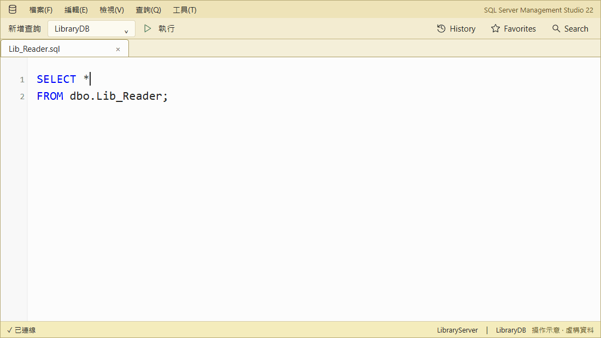
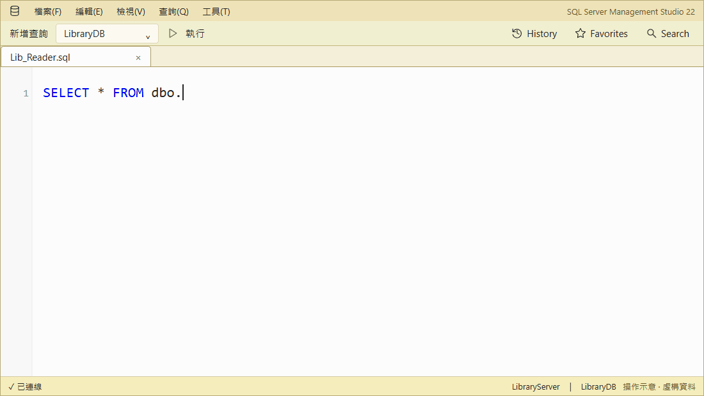
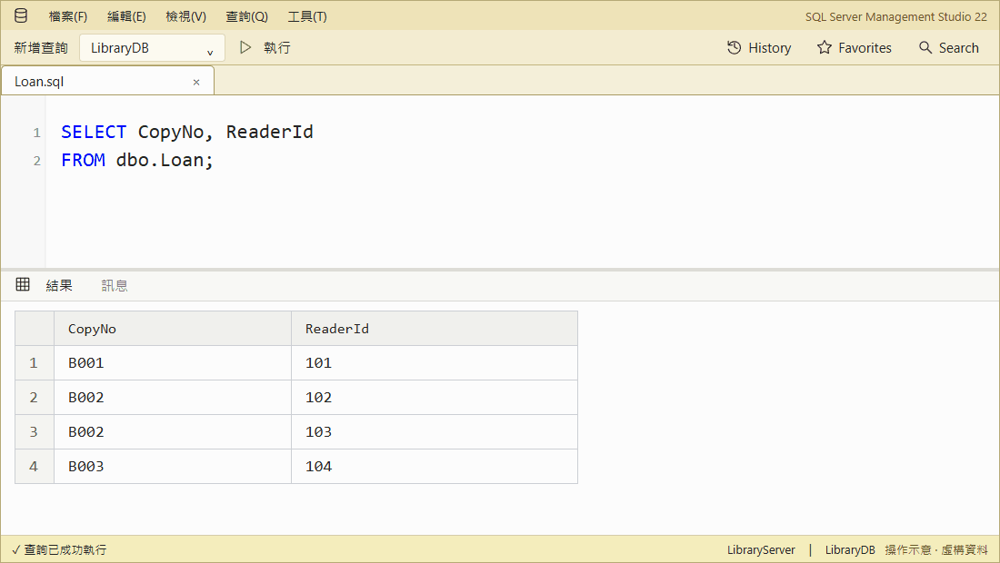

# SqlAssist for SSMS 22

**Complete SQL, inspect objects, and save queries in SSMS 22.**

[繁體中文](README.zh-TW.md)

An **SSMS 22** extension with local suggestions and metadata—no cloud or AI.

[Start](docs/getting-started.md) · [Docs](docs/index.md) ·
[Issues](https://github.com/a73013110/SqlAssist.Ssms22/issues)

## Feature tour

Demos use fictional data; they are illustrations, not recordings or benchmarks.
[Player](https://a73013110.github.io/SqlAssist.Ssms22/demos/feature-demos.html).

### Complete SQL

Type `libr` → **Right Arrow** previews columns → **Tab** inserts `Lib_Reader`.
Also supports clause context, fuzzy matches, aliases, and temp tables.

[PNG](docs/images/completion-preview-demo.png)

### Expand SQL with Tab

After `*`, press **Tab** to expand columns. Tab also generates `INSERT`, `EXEC`, `MERGE`, and
`ALTER` SQL; this demo uses one column per line.

[PNG](docs/images/expand-star-demo.png)

[INSERT demo](docs/images/insert-template-demo.gif): columns and typed placeholders. [PNG](docs/images/insert-template-demo.png)

| `INSERT` | `EXEC` |
|:---:|:---:|
|  |  |
| **`MERGE`** | **`ALTER PROCEDURE / FUNCTION`** |
|  |  |

### Preview object structure inline

Type `libr`, select `Lib_Reader`, and press **Right Arrow** to open the structure preview below the
suggestions. Switch to **Script** to inspect columns, indexes, keys, parameters, and the full DDL
without leaving the current query window.

[PNG](docs/images/structure-preview-demo.png)

On `Loan`, **F12** opens its definition on the current connection without execution.

[F12 PNG](docs/images/f12-definition-demo.png)

### Search database objects

Find `CopyNo` in **Search**, then use **›** for the next definition match. Filter by connection or type;
row data is not searched.

[PNG](docs/images/sql-search-demo.png)

### History and Favorites

Find `Loan` in **History**, save it with **☆**, then open it from **Favorites** on the current
connection without execution.

[PNG](docs/images/sql-memory-demo.png)

### Reuse query results

Copy selected cells as an `IN` predicate and paste after `WHERE`. The grid menu also supports
`#temp`, Markdown, JSON, profiling, and full cell content.

[PNG](docs/images/result-in-demo.png)

### Wrap SQL with snippets

Select SQL, choose **Surround with snippet**, apply `ifb`, edit its condition, then press **Tab**.

[PNG](docs/images/surround-snippet-demo.png)

## Install

Requires **Windows x64** and **SSMS 22.9.x**.

1. Download `SqlAssist.Ssms22.vsix` from the latest [release](https://github.com/a73013110/SqlAssist.Ssms22/releases).
2. Close SSMS, run the VSIX installer, and restart SSMS.
3. **Tools → SqlAssist** confirms that it loaded.

> [!IMPORTANT]
> Keep SSMS T-SQL IntelliSense enabled; only its conflicting automatic list is suppressed.

> [!WARNING]
> [SSMS does not officially support third-party extensions](https://learn.microsoft.com/en-us/ssms/faq#are-extensions-supported-in-ssms).
> This project is validated on SSMS 22.9.x.

## Learn more

[Docs](docs/index.md) · [Contributing](CLAUDE.md) · [Apache License 2.0](LICENSE)
