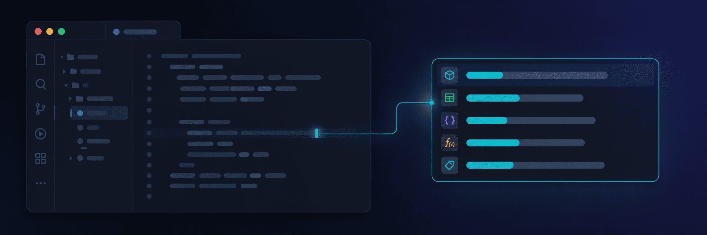
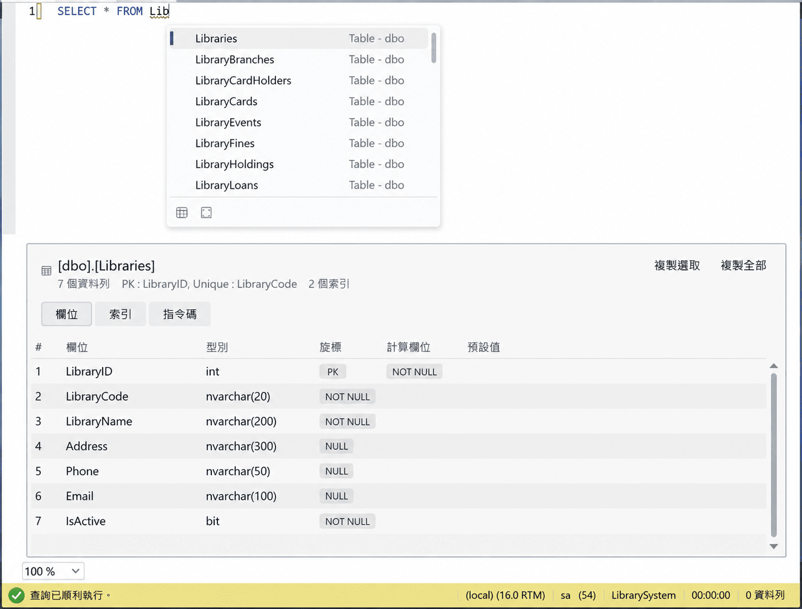

# SqlAssist for SSMS 22

**在 SSMS 22 的原生 T-SQL 編輯器中，提供理解目前資料庫的即時建議、SQL 展開與物件預覽。**

[繁體中文](README.zh-TW.md) · [English](README.md)

  

SqlAssist 是安裝於 **SQL Server Management Studio 22** 的 VSIX，不是另一套編輯器。
建議完全在本機計算；結構資訊只向你已連線的 SQL Server 查詢，不經雲端，也沒有 AI 模型參與。

[安裝與開始使用](docs/getting-started.md) ·
[下載 VSIX](https://github.com/a73013110/SqlAssist.Ssms22/releases) ·
[回報問題](https://github.com/a73013110/SqlAssist.Ssms22/issues) ·
[文件索引](docs/index.md)

## 主要功能

  

- **上下文感知補全**：依 `SELECT`、`FROM`、`JOIN`、`EXEC` 等位置收斂候選；支援
  詞首／CamelHump 模糊比對、別名欄位、`@變數`、`#temp` 與關鍵字自動大寫。
- **SQL 展開**：在 `*` 後按 Tab 展開欄位；提交 `INSERT`、`MERGE`、`EXEC` 或
  `ALTER` 目標時，可產生欄位、參數、骨架或完整定義。
- **片段與自動配對**：內建 T-SQL 片段、Tab Stop 導航，以及括號、引號、方括號配對。
- **結構預覽與 F12**：從提示或浮動視窗查看欄位、索引、外來鍵、參數與 DDL；F12 在
  沿用目前連線的新查詢視窗開啟定義。
- **結果格線工具**：將選取資料轉成 `#temp`、`IN`、Markdown 或 JSON；可做欄位剖析，
  也能查看超過 SSMS 格線顯示上限的單格完整內容。

## 安裝

需要 **Windows x64** 與 **SSMS 22.9.x**；一般使用者不必 clone 專案或安裝 .NET SDK。

1. 從 [Releases](https://github.com/a73013110/SqlAssist.Ssms22/releases) 的最新版本下載
   `SqlAssist.Ssms22.vsix`。
2. 儲存查詢並關閉所有 SSMS 視窗。
3. 開啟 VSIX，確認目標為 **SQL Server Management Studio 22**。
4. 重啟 SSMS；看到「工具 → SqlAssist」即代表載入成功。

> [!IMPORTANT]
> 保持 SSMS 內建 T-SQL IntelliSense 開啟。SqlAssist 只抑制會互相干擾的自動清單；
> 錯誤波浪線、大綱與參數提示仍由 SSMS 提供。

> [!WARNING]
> [SSMS 目前未正式支援第三方擴充套件](https://learn.microsoft.com/en-us/ssms/faq#are-extensions-supported-in-ssms)。
> 本專案以 SSMS 22.9.x 實機驗證，SSMS 更新後可能需要重新確認相容性。

## 文件

| 需求 | 入口 |
|---|---|
| 安裝、確認載入、更新、解除安裝 | [開始使用](docs/getting-started.md) |
| 補全、展開、片段、預覽、結果格線與設定 | [文件路由](docs/index.md#主題) |
| 建置與測試 | [開發](docs/development.md) |
| 版本、發布與安裝 VSIX | [發布](docs/release.md) |
| 分層與平台邊界 | [架構](docs/architecture.md) |

開發者應先讀 [CLAUDE.md](CLAUDE.md)；它會要求依實際修改範圍讀取必要護欄，避免載入
不相關文件。專案採用 [MIT License](LICENSE)。
